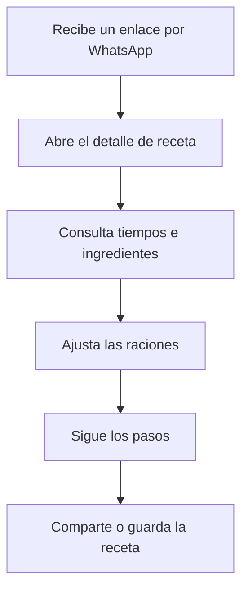
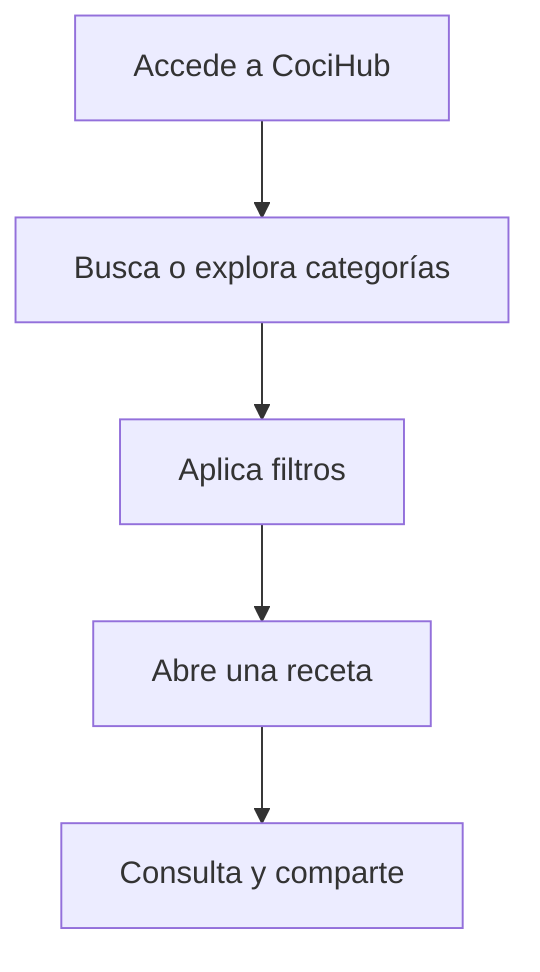
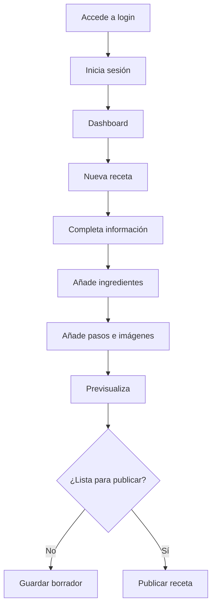
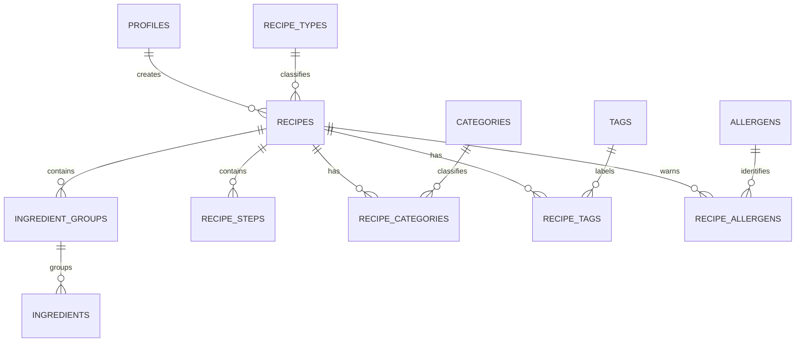

<div align="center">

# 🍳 CociHub

### Tus recetas, siempre a mano.

Plataforma web de recetas personales diseñada para consultar, organizar, adaptar y compartir recetas desde cualquier dispositivo.

[](#-roadmap)
[](#-roadmap)
[](#-stack-tecnológico-previsto)
[](#-stack-tecnológico-previsto)
[](#-stack-tecnológico-previsto)

</div>

---

## 📖 Índice

- [Descripción](#-descripción)
- [Origen y problema](#-origen-y-problema)
- [Objetivos](#-objetivos)
- [Público objetivo](#-público-objetivo)
- [Alcance del MVP](#-alcance-del-mvp)
- [Historias de usuario](#-historias-de-usuario)
- [Arquitectura de información](#-arquitectura-de-información)
- [Rutas previstas](#-rutas-previstas)
- [Pantallas principales](#-pantallas-principales)
- [Flujos de usuario](#-flujos-de-usuario)
- [Sistema de recetas](#-sistema-de-recetas)
- [Modelo de datos](#-modelo-de-datos)
- [Identidad visual](#-identidad-visual)
- [Diseño responsive](#-diseño-responsive)
- [Componentes previstos](#-componentes-previstos)
- [Stack tecnológico](#-stack-tecnológico-previsto)
- [Roadmap](#-roadmap)
- [Criterios de éxito](#-criterios-de-éxito-del-mvp)
- [Fuera del MVP](#-fuera-del-mvp)
- [Autor](#-autor)

---

# 📌 Descripción

**CociHub** será una plataforma web de recetas personales creada inicialmente para compartir recetas con familiares, amigos y compañeros de trabajo.

La aplicación permitirá centralizar las recetas, organizarlas por tipos, categorías y etiquetas, consultarlas cómodamente desde el móvil, ajustar las cantidades según el número de raciones y compartirlas mediante WhatsApp o enlace.

Aunque el público inicial será cercano, el proyecto se diseña desde el principio con una arquitectura preparada para crecer hasta convertirse en una plataforma pública de recetas.

CociHub tiene también una finalidad profesional: convertirse en una pieza destacada del portfolio de **Sergio Cáceres**, demostrando el desarrollo completo de una aplicación real, desde el análisis funcional y el diseño UX/UI hasta la base de datos, la seguridad, el despliegue y el mantenimiento.

---

# 💡 Origen y problema

Actualmente, las recetas se comparten mediante estados y mensajes de WhatsApp. Este método funciona para una comunicación puntual, pero presenta varias limitaciones:

- Las recetas desaparecen o se pierden entre conversaciones.
- No existe un catálogo organizado.
- Es difícil localizar una receta antigua.
- Los ingredientes y pasos no están siempre estructurados.
- No se pueden adaptar fácilmente las cantidades.
- La información depende de capturas, fotografías o mensajes aislados.
- No existe una URL permanente que pueda guardarse y compartirse.

CociHub nace para convertir ese contenido disperso en una experiencia digital organizada, visual y duradera.

> **Problema principal:** las recetas personales existen, generan interés y se comparten, pero no disponen de un espacio centralizado, accesible y reutilizable.

> **Solución propuesta:** una aplicación web mobile first donde consultar, adaptar y compartir recetas sin necesidad de registro.

---

# 🎯 Objetivos

## Objetivo principal

Crear una aplicación web moderna, responsive y sencilla de utilizar donde los visitantes puedan **consultar, buscar, adaptar y compartir recetas publicadas por el administrador**.

## Objetivos funcionales

- [ ] Centralizar todas las recetas en una única plataforma.
- [ ] Mostrar cada receta de forma clara y estructurada.
- [ ] Facilitar la consulta desde el móvil mientras se cocina.
- [ ] Permitir búsquedas y filtros.
- [ ] Organizar las recetas mediante tipos, categorías y etiquetas.
- [ ] Recalcular ingredientes según las raciones.
- [ ] Compartir recetas mediante WhatsApp o enlace.
- [ ] Permitir al administrador crear, editar, publicar y eliminar recetas.
- [ ] Preparar la aplicación para futuras funciones sociales.

## Objetivos técnicos

- [ ] Construir la aplicación con Next.js y React.
- [ ] Utilizar TypeScript.
- [ ] Implementar una interfaz mobile first.
- [ ] Crear componentes reutilizables.
- [ ] Desarrollar formularios dinámicos.
- [ ] Validar datos en cliente y servidor.
- [ ] Implementar autenticación y rutas protegidas.
- [ ] Diseñar una base de datos relacional.
- [ ] Implementar un CRUD completo.
- [ ] Gestionar imágenes y almacenamiento.
- [ ] Aplicar controles de acceso y seguridad.
- [ ] Implementar SEO técnico.
- [ ] Desplegar la aplicación en producción.
- [ ] Mantener un flujo profesional de Git y GitHub.

## Objetivos de portfolio

El proyecto deberá mostrar claramente:

- El problema real que resuelve.
- El análisis de necesidades.
- La planificación del MVP.
- La arquitectura elegida.
- El diseño de la base de datos.
- Las decisiones de UX/UI.
- La separación entre área pública y privada.
- Los retos técnicos y sus soluciones.
- La evolución futura del producto.
- La calidad del código y de la documentación.

---

# 👥 Público objetivo

## Público inicial

- Familiares.
- Amigos.
- Compañeros de trabajo.
- Personas que actualmente reciben las recetas mediante WhatsApp.
- Usuarios con conocimientos digitales básicos.
- Personas que consultarán las recetas principalmente desde el móvil.

## Público futuro

- Personas interesadas en cocina casera.
- Usuarios que busquen recetas prácticas.
- Cocineros aficionados.
- Personas que quieran publicar sus propias recetas.
- Usuarios interesados en planificación de menús.
- Personas que necesiten listas de la compra.
- Comunidades gastronómicas.

## Necesidades principales

El usuario debe poder:

- Encontrar rápidamente una receta.
- Entender los ingredientes y los pasos.
- Consultarla cómodamente mientras cocina.
- Identificar tiempo, dificultad y raciones.
- Ajustar las cantidades.
- Compartirla sin registrarse.
- Guardar el enlace para consultarlo más adelante.

---

# ✅ Alcance del MVP

El MVP será la primera versión funcional, desplegable y utilizable de CociHub.

Su objetivo no es implementar todas las ideas futuras, sino resolver correctamente el problema principal: **publicar, consultar y compartir recetas personales**.

## 🌍 Área pública

### Inicio

- [ ] Presentación breve de CociHub.
- [ ] Hero principal con eslogan.
- [ ] Buscador de recetas.
- [ ] Acceso a recetas destacadas.
- [ ] Últimas recetas publicadas.
- [ ] Categorías principales.
- [ ] Bloque sobre el origen del proyecto.
- [ ] Llamada a la acción para explorar recetas.

### Listado de recetas

- [ ] Mostrar todas las recetas publicadas.
- [ ] Buscar por nombre.
- [ ] Filtrar por tipo.
- [ ] Filtrar por categoría.
- [ ] Filtrar por dificultad.
- [ ] Filtrar por duración.
- [ ] Filtrar mediante etiquetas.
- [ ] Ordenar por fecha.
- [ ] Ordenar por tiempo de preparación.
- [ ] Mostrar el número de resultados.
- [ ] Limpiar filtros.
- [ ] Mostrar un estado sin resultados.
- [ ] Implementar paginación o carga progresiva.

### Detalle de receta

- [ ] Título.
- [ ] Imagen principal.
- [ ] Descripción e introducción.
- [ ] Autor.
- [ ] Tipo principal.
- [ ] Categorías.
- [ ] Etiquetas.
- [ ] Dificultad.
- [ ] Tiempo de preparación.
- [ ] Tiempo de cocción.
- [ ] Tiempo adicional.
- [ ] Tiempo total calculado.
- [ ] Número base de raciones.
- [ ] Selector de raciones.
- [ ] Recalculado automático de cantidades.
- [ ] Ingredientes agrupados.
- [ ] Pasos ordenados.
- [ ] Imágenes opcionales por paso.
- [ ] Consejos.
- [ ] Sustituciones.
- [ ] Conservación.
- [ ] Congelación.
- [ ] Recalentado.
- [ ] Información orientativa sobre alérgenos.
- [ ] Fecha de publicación.
- [ ] Botón de WhatsApp.
- [ ] Botón para copiar enlace.
- [ ] Recetas relacionadas.

### Navegación y sistema

- [ ] Cabecera pública.
- [ ] Menú responsive.
- [ ] Migas de pan.
- [ ] Footer.
- [ ] Página Sobre CociHub.
- [ ] Página 404.
- [ ] Página de error general.
- [ ] Aviso legal.
- [ ] Política de privacidad.
- [ ] Política de cookies.

---

## 🔐 Área privada

### Autenticación

- [ ] Inicio de sesión.
- [ ] Cierre de sesión.
- [ ] Protección de rutas administrativas.
- [ ] Mensajes de error claros.
- [ ] Sesión segura.
- [ ] Acceso al panel únicamente para el administrador.

### Dashboard

- [ ] Total de recetas.
- [ ] Número de recetas publicadas.
- [ ] Número de borradores.
- [ ] Número de categorías.
- [ ] Últimas recetas modificadas.
- [ ] Acceso directo a crear una receta.
- [ ] Enlace para ver la web pública.

### Gestión de recetas

- [ ] Listado de recetas.
- [ ] Búsqueda administrativa.
- [ ] Filtro por estado.
- [ ] Filtro por categoría.
- [ ] Ordenación.
- [ ] Crear receta.
- [ ] Editar receta.
- [ ] Eliminar con confirmación.
- [ ] Guardar como borrador.
- [ ] Publicar.
- [ ] Despublicar.
- [ ] Archivar.
- [ ] Marcar como destacada.
- [ ] Previsualizar antes de publicar.

### Formulario de receta

> Los módulos visuales del formulario ya están diseñados en `/design-system`. Su integración funcional definitiva en `RecipeForm` todavía está pendiente.

- [x] Diseñar información básica.
- [x] Diseñar imagen principal.
- [x] Diseñar clasificación: tipo, categorías, etiquetas, dificultad y destacada.
- [x] Diseñar raciones base y demostración de recalculado.
- [x] Diseñar tiempos y cálculo automático del total.
- [x] Diseñar grupos e ingredientes dinámicos.
- [x] Diseñar indicador `scalable` por ingrediente.
- [x] Diseñar pasos dinámicos y reordenables.
- [x] Diseñar información adicional.
- [x] Diseñar fuente y procedencia.
- [x] Diseñar alérgenos presentes y posibles.
- [x] Diseñar estados `draft`, `published` y `archived`.
- [x] Diseñar acciones de borrador, previsualización, publicación, despublicación y archivado.
- [ ] Integrar los módulos en `RecipeForm`.
- [ ] Conectar validación real con React Hook Form + Zod.
- [ ] Conectar subida real de imágenes.
- [ ] Persistir datos en Supabase.

### Gestión auxiliar

- [ ] Gestión de categorías.
- [ ] Gestión de etiquetas.

> En el MVP no se crearán páginas administrativas independientes para alérgenos, imágenes o ajustes. Los alérgenos partirán de un catálogo predefinido y las imágenes se gestionarán desde los propios formularios.

---

## ⚙️ Requisitos técnicos del MVP

- [ ] Arquitectura mobile first.
- [ ] Validación en cliente y servidor.
- [ ] Estados de carga.
- [ ] Estados vacíos.
- [ ] Gestión de errores.
- [ ] Confirmaciones para acciones destructivas.
- [ ] Mensajes de éxito y error.
- [ ] URLs amigables mediante slugs.
- [ ] Optimización de imágenes.
- [ ] Metadatos SEO.
- [ ] Open Graph.
- [ ] Sitemap.
- [ ] `robots.txt`.
- [ ] Accesibilidad básica.
- [ ] Despliegue en Vercel.
- [ ] Base de datos PostgreSQL.
- [ ] Autenticación y almacenamiento en Supabase.
- [ ] Variables de entorno seguras.
- [ ] Políticas de acceso a datos.

---

# 🧑‍🍳 Historias de usuario

## Visitante

- Como visitante, quiero consultar recetas sin registrarme para utilizarlas rápidamente.
- Como visitante, quiero buscar por nombre para encontrar una receta sin recorrer todo el catálogo.
- Como visitante, quiero filtrar por categoría para descubrir recetas relacionadas.
- Como visitante, quiero ver tiempos, dificultad y raciones antes de empezar.
- Como visitante, quiero ajustar las raciones para obtener las cantidades necesarias.
- Como visitante, quiero consultar ingredientes y pasos cómodamente desde el móvil.
- Como visitante, quiero compartir una receta por WhatsApp.
- Como visitante, quiero copiar el enlace para guardarlo o enviarlo.

## Administrador

- Como administrador, quiero iniciar sesión para gestionar el contenido.
- Como administrador, quiero crear recetas mediante un formulario estructurado.
- Como administrador, quiero añadir y reordenar ingredientes y pasos.
- Como administrador, quiero guardar borradores antes de publicar.
- Como administrador, quiero previsualizar una receta.
- Como administrador, quiero editar recetas ya publicadas.
- Como administrador, quiero subir imágenes sin modificar el código.
- Como administrador, quiero publicar, despublicar o archivar recetas.

---

# 🧭 Arquitectura de información

CociHub se divide en dos áreas claramente diferenciadas:

| Área | Acceso | Finalidad |
|---|---|---|
| Pública | Sin autenticación | Consultar, buscar, adaptar y compartir recetas |
| Privada | Administrador autenticado | Gestionar recetas, clasificaciones, imágenes y ajustes |

## Sitemap

```text
CociHub
│
├── Home
│   ├── Search
│   ├── Featured recipes
│   ├── Latest recipes
│   ├── Main categories
│   └── About CociHub preview
│
├── Recipes
│   ├── All recipes
│   ├── Search results
│   ├── Filters and sorting
│   └── Recipe detail
│       ├── General information
│       ├── Ingredients
│       ├── Preparation
│       ├── Tips
│       ├── Substitutions
│       ├── Storage
│       ├── Allergens
│       └── Share
│
├── Categories
│   ├── All categories
│   └── Category detail
│       └── Related recipes
│
├── About
├── Login
│
├── Admin
│   ├── Dashboard
│   ├── Recipes
│   │   ├── List
│   │   ├── New recipe
│   │   ├── Edit recipe
│   │   └── Preview
│   ├── Categories
│   └── Tags
│
├── Design system (internal)
│
└── System
    ├── 404
    ├── General error
    ├── Legal notice
    ├── Privacy
    └── Cookies
```

---

# 🛣️ Rutas previstas

Las rutas del proyecto utilizarán nombres en inglés para mantener coherencia con la estructura técnica, componentes y convenciones del código.

## Públicas

```text
/
/recipes
/recipes/[slug]
/categories
/categories/[slug]
/about
/privacy
/cookies
/legal-notice
```

La búsqueda se resolverá mediante parámetros sobre el listado, por ejemplo:

```text
/recipes?search=falafel
```

No se creará una ruta independiente `/search` en el MVP.

## Autenticación

```text
/login
```

## Administración

```text
/admin
/admin/recipes
/admin/recipes/new
/admin/recipes/[id]/edit
/admin/categories
/admin/tags
```

## Desarrollo interno

```text
/design-system
```

> `/design-system` es una ruta interna de trabajo utilizada para documentar y probar tokens, componentes UI y módulos administrativos durante la Fase 3.

---

# 🖥️ Pantallas principales

## 1. Página de inicio

### Objetivo

Presentar CociHub, facilitar la búsqueda y dirigir al usuario hacia el contenido.

### Estructura

```text
Cabecera
↓
Hero principal
  ├── Título
  ├── Eslogan
  ├── Texto introductorio
  ├── Buscador
  └── Botón "Ver todas las recetas"
↓
Recetas destacadas
↓
Categorías principales
↓
Últimas recetas
↓
Sobre CociHub
↓
Footer
```

### Contenido inicial recomendado

- Entre 3 y 6 recetas destacadas.
- Seis categorías prioritarias:
  - Entrantes.
  - Platos principales.
  - Guarniciones.
  - Postres.
  - Desayunos.
  - Recetas rápidas.

---

## 2. Listado de recetas

### Objetivo

Permitir encontrar recetas mediante búsqueda, filtros y ordenación.

### Escritorio

- Buscador superior.
- Panel lateral de filtros.
- Contador de resultados.
- Selector de ordenación.
- Cuadrícula de tres tarjetas por fila.
- Paginación.

### Móvil

- Buscador.
- Botón de filtros.
- Botón de ordenación.
- Filtros dentro de un panel o modal.
- Una tarjeta por fila.
- Botón de carga progresiva o paginación simplificada.

---

## 3. Tarjeta de receta

Cada tarjeta mostrará:

- Imagen principal.
- Tipo de receta.
- Título.
- Descripción corta.
- Tiempo total.
- Dificultad.
- Raciones opcionales.
- Etiquetas principales.
- Indicador de receta destacada.

### Comportamiento

- Toda la tarjeta será clicable.
- El título ocupará como máximo dos líneas.
- La descripción ocupará como máximo tres líneas.
- La imagen tendrá un zoom muy ligero en `hover`.
- No se utilizarán animaciones agresivas.
- El estado de foco será visible para navegación por teclado.

---

## 4. Detalle de receta

Esta será la pantalla más importante de CociHub.

### Cabecera de receta

- Migas de pan.
- Título.
- Introducción.
- Imagen principal.
- Etiquetas.
- Tiempo total.
- Raciones.
- Dificultad.
- Acciones de compartir.

### Contenido

```text
Ingredientes
  ├── Selector de raciones
  ├── Grupos
  └── Ingredientes recalculados

Elaboración
  ├── Pasos numerados
  ├── Imagen opcional
  ├── Duración opcional
  └── Consejo opcional

Información adicional
  ├── Consejos
  ├── Sustituciones
  ├── Conservación
  ├── Congelación
  ├── Recalentado
  └── Alérgenos

Recetas relacionadas
```

### Selector de raciones

```text
Raciones

[ − ]  4 personas  [ + ]
```

Reglas previstas:

- El valor mínimo será 1.
- Las cantidades se recalcularán automáticamente.
- Se conservará la ración original como referencia.
- Se evitarán decimales innecesarios.
- Expresiones como `al gusto` o `una pizca` no se modificarán.
- Las cantidades se redondearán de forma legible.

---

## 5. Categorías

### Listado

Cada tarjeta de categoría incluirá:

- Imagen o icono.
- Nombre.
- Número de recetas.

### Detalle de categoría

- Nombre.
- Descripción.
- Imagen opcional.
- Número de recetas.
- Recetas asociadas.
- Filtros secundarios.
- Categorías relacionadas.

---

## 6. Sobre CociHub

La página explicará:

- El origen del proyecto.
- La necesidad que resuelve.
- Quién está detrás.
- Las tecnologías utilizadas.
- Su finalidad como proyecto real y de portfolio.
- La evolución prevista.
- Un enlace directo a las recetas.

---

## 7. Login

- Logotipo.
- Título de acceso.
- Correo electrónico.
- Contraseña.
- Botón de inicio de sesión.
- Mensajes de error.
- Enlace para volver a la web.
- Sin registro público en el MVP.

---

## 8. Dashboard administrativo

Mostrará:

- Total de recetas.
- Recetas publicadas.
- Borradores.
- Categorías.
- Últimas recetas modificadas.
- Acceso a crear una receta.
- Acceso a la web pública.
- Cierre de sesión.

---

## 9. Gestión de recetas

### Escritorio

Tabla con:

- Imagen.
- Título.
- Estado.
- Categoría.
- Fecha.
- Acciones.

### Móvil

La tabla se transformará en tarjetas administrativas con:

- Título.
- Estado.
- Categoría.
- Fecha.
- Botón de edición.
- Menú de acciones.

---

## 10. Formulario de receta

El formulario administrativo se ha definido mediante módulos independientes y reutilizables:

1. **Información básica**
2. **Imagen principal**
3. **Clasificación**
4. **Raciones y comensales**
5. **Tiempos**
6. **Ingredientes**
7. **Elaboración**
8. **Información adicional**
9. **Alérgenos**
10. **Publicación**

Durante la Fase 3 cada módulo se está desarrollando primero como componente demostrativo dentro de `/design-system`. El siguiente paso será integrarlos en un único `RecipeForm`.

### Comportamiento previsto

- Validación junto al campo.
- Ingredientes y pasos dinámicos.
- Reordenación de elementos.
- Aviso de cambios sin guardar.
- Confirmación antes de abandonar el formulario.
- Barra de acciones fija en escritorio.
- Barra inferior de acciones en móvil.
- Acciones de guardar, previsualizar y publicar.

---

# 🔄 Flujos de usuario

## Flujo principal del visitante



## Flujo de descubrimiento



## Flujo del administrador



---

# 🍽️ Sistema de recetas

## Tipos principales

- Desayunos.
- Aperitivos.
- Entrantes.
- Primeros platos.
- Segundos platos.
- Platos únicos.
- Guarniciones.
- Ensaladas.
- Sopas y cremas.
- Salsas.
- Panes y masas.
- Postres.
- Bebidas.
- Snacks.
- Conservas.
- Repostería.

## Clasificaciones complementarias

### Por ingrediente principal

Carne, pollo, pescado, marisco, verduras, legumbres, pasta, arroz, patata, huevos, queso, frutas y chocolate.

### Por estilo de alimentación

Vegetariana, vegana, sin gluten, sin lactosa, alta en proteínas, baja en calorías y saludable.

> Las etiquetas alimentarias y de alérgenos serán orientativas. No se afirmará que una receta es segura para una alergia cuando pueda existir contaminación cruzada o depender de marcas concretas.

### Por dificultad

- Fácil.
- Media.
- Difícil.

### Por duración

- Menos de 15 minutos.
- Entre 15 y 30 minutos.
- Entre 30 y 60 minutos.
- Más de 60 minutos.

### Por origen

Española, italiana, francesa, mexicana, japonesa, china, india, mediterránea, americana e internacional.

### Por contexto

Recetas rápidas, económicas, para llevar, para compartir, celebraciones, batch cooking, aprovechamiento y recetas familiares.

## Regla del MVP

Cada receta tendrá:

- **Un tipo principal obligatorio.**
- **Una o varias categorías.**
- **Cero o varias etiquetas.**

Ejemplo:

```text
Falafel de remolacha
├── Tipo: Entrante
├── Categorías: Legumbres, Verduras
└── Etiquetas: Vegetariana, Para compartir, Internacional
```

---

# 🧾 Estructura de una receta

## Información principal

- Título.
- Slug.
- Descripción corta.
- Introducción.
- Imagen principal.
- Autor.
- Estado.
- Dificultad.
- Raciones.
- Tiempo de preparación.
- Tiempo de cocción.
- Tiempo adicional.
- Tipo principal.
- Categorías.
- Etiquetas.
- Indicador de receta destacada.

## Ingredientes

Cada ingrediente tendrá:

- Nombre.
- Cantidad numérica opcional.
- Unidad.
- Notas opcionales.
- Grupo.
- Posición.
- Indicador `scalable` para decidir si la cantidad debe recalcularse al cambiar las raciones.

Los grupos permitirán separar, por ejemplo:

```text
Para la masa
Para el relleno
Para la salsa
Para decorar
```

Las cantidades numéricas podrán ser decimales. Las expresiones no numéricas se representarán sin cantidad escalable:

```text
0,5 cebollas
1,5 litros
2,25 cucharadas
Sal — al gusto
Aceite — cantidad necesaria
```

Al cambiar las raciones solo se recalcularán los ingredientes con cantidad numérica y `scalable = true`. Expresiones como `al gusto`, `una pizca` o `cantidad necesaria` permanecerán sin cambios.

## Pasos

Cada paso tendrá:

- Posición.
- Título opcional.
- Instrucción.
- Imagen opcional.
- Duración opcional.
- Consejo opcional.

## Información adicional

- Consejos.
- Sustituciones.
- Conservación.
- Congelación.
- Recalentado.
- Fuente o procedencia.
- Autor o referencia de la fuente.
- Página o URL cuando corresponda.
- Notas sobre adaptaciones realizadas.
- Fechas de creación, actualización y publicación.

## Alérgenos

Los alérgenos se tratarán de forma independiente y orientativa:

- **Presentes:** forman parte directamente de la receta.
- **Posibles / trazas:** pueden depender de la marca, elaboración industrial o contaminación cruzada.

La interfaz no afirmará que una receta es completamente segura para una alergia y recomendará comprobar siempre el etiquetado de los productos utilizados.

---

# 🗃️ Modelo de datos

## Diagrama conceptual



## Tablas previstas

| Tabla | Finalidad |
|---|---|
| `profiles` | Perfil y rol del administrador; preparada para futuros usuarios |
| `recipes` | Información principal de las recetas |
| `recipe_types` | Tipo principal de la preparación |
| `categories` | Clasificación temática |
| `recipe_categories` | Relación muchos a muchos entre recetas y categorías |
| `tags` | Etiquetas complementarias |
| `recipe_tags` | Relación muchos a muchos entre recetas y etiquetas |
| `ingredient_groups` | Bloques de ingredientes |
| `ingredients` | Ingredientes, cantidades, unidades, notas y comportamiento `scalable` |
| `recipe_steps` | Pasos ordenados de elaboración |
| `allergens` | Catálogo de alérgenos |
| `recipe_allergens` | Relación entre recetas y alérgenos, incluyendo presencia `present` o `possible` |

## Estados previstos

### Dificultad

```text
easy
medium
hard
```

### Estado de receta

```text
draft
published
archived
```

### Presencia de alérgenos

```text
present
possible
```

### Roles preparados

```text
admin
editor
user
```

En el MVP solo se utilizará el rol `admin`.

## Tiempo total

El tiempo total no se almacenará como campo independiente. Se calculará mediante:

```text
tiempo total =
  preparación
  + cocinado
  + tiempo adicional
```

---

# 🎨 Identidad visual

## Personalidad de marca

CociHub debe transmitir:

- Cercanía.
- Cocina casera.
- Confianza.
- Organización.
- Calidez.
- Sencillez.
- Modernidad.
- Comunidad.
- Accesibilidad.

Debe evitar parecer:

- Un restaurante de lujo.
- Una plataforma fría o corporativa.
- Una tienda de productos.
- Una aplicación excesivamente técnica.
- Una red social saturada.

## Concepto visual

La identidad combinará el carácter cálido de la cocina casera con la claridad de una plataforma digital moderna.

Principios visuales:

- Fotografías gastronómicas como protagonistas.
- Fondos claros.
- Tarjetas limpias.
- Bordes suaves.
- Sombras discretas.
- Pequeños acentos de color.
- Interfaz limpia y fácil de recorrer.

## Nombre y eslogan

```text
CociHub
Tus recetas, siempre a mano.
```

La separación entre `Coci` y `Hub` se reforzará con la mayúscula `H`.

## Ideas para el isotipo

- Olla combinada con un nodo de conexión.
- Plato con varios puntos conectados.
- Cuchara y tenedor formando una casa.
- Campana de cocina con un símbolo de comunidad.
- Letra `C` envolviendo una `H`.
- Libro de recetas con forma de plato.

El logotipo deberá funcionar:

- En horizontal.
- En formato cuadrado.
- Como favicon.
- Sobre fondo claro.
- Sobre fondo oscuro.
- En tamaños pequeños.

---

## Paleta de colores

| Uso | Nombre | Color |
|---|---|---|
| Principal | Terracota | `#D95D39` |
| Principal oscuro | Terracota oscuro | `#A63F25` |
| Secundario | Verde salvia | `#718C66` |
| Secundario oscuro | Verde bosque suave | `#4E6847` |
| Acento | Mostaza | `#E5A93D` |
| Fondo principal | Crema claro | `#FFF9F2` |
| Fondo secundario | Beige suave | `#F4E9DC` |
| Superficie | Blanco | `#FFFFFF` |
| Texto principal | Carbón | `#292522` |
| Texto secundario | Gris cálido | `#6F675F` |
| Bordes | Beige grisáceo | `#DED3C8` |
| Éxito | Verde | `#3F7D57` |
| Advertencia | Naranja | `#D48B24` |
| Error | Rojo | `#C84545` |
| Información | Azul | `#3978A8` |

### Variables CSS iniciales

```css
:root {
  --color-primary: #d95d39;
  --color-primary-dark: #a63f25;

  --color-secondary: #718c66;
  --color-secondary-dark: #4e6847;

  --color-accent: #e5a93d;

  --color-background: #fff9f2;
  --color-background-secondary: #f4e9dc;
  --color-surface: #ffffff;

  --color-text: #292522;
  --color-text-muted: #6f675f;
  --color-border: #ded3c8;

  --color-success: #3f7d57;
  --color-warning: #d48b24;
  --color-error: #c84545;
  --color-info: #3978a8;
}
```

## Tipografía

| Uso | Tipografía |
|---|---|
| Títulos y contenido editorial | Lora |
| Interfaz, navegación, formularios y textos | Inter |

### Jerarquía prevista

- Hero: 32–40 px en móvil / 40–56 px en escritorio.
- Título de página: 32–40 px.
- Título de sección: 24–32 px.
- Título de tarjeta: 18–22 px.
- Texto general: 16 px.
- Texto de receta: 17–18 px con interlineado amplio.
- Texto auxiliar: 13–14 px.

---

# 📱 Diseño responsive

CociHub seguirá una estrategia **mobile first**, ya que gran parte del tráfico inicial llegará desde enlaces de WhatsApp.

## Móvil

- Hasta 767 px.
- Una columna.
- Tarjetas a ancho completo.
- Navegación desplegable.
- Botones grandes.
- Filtros en modal o panel.
- Ingredientes y pasos optimizados para cocinar.
- Barra inferior de acciones en formularios administrativos.

## Tablet

- Entre 768 y 1023 px.
- Dos columnas de tarjetas.
- Menú administrativo plegable.
- Mejor aprovechamiento horizontal.

## Escritorio

- Desde 1024 px.
- Tres o cuatro columnas de tarjetas.
- Navegación completa.
- Filtros laterales.
- Ingredientes y elaboración en dos columnas.
- Sidebar administrativa permanente.

## Contenedor y espaciado

```text
Ancho máximo: 1280 px
Padding móvil: 16 px
Padding tablet: 24 px
Padding escritorio: 32 px
```

Escala de espaciado prevista:

```text
4 · 8 · 12 · 16 · 24 · 32 · 48 · 64 · 96 px
```

Radios previstos:

```text
8 · 12 · 16 · 20 px
```

---

# 🧱 Componentes previstos

## Públicos

- `Header`
- `MobileMenu`
- `Footer`
- `SearchBar`
- `RecipeCard`
- `CategoryCard`
- `Tag`
- `Button`
- `Breadcrumbs`
- `Pagination`
- `SectionTitle`
- `EmptyState`
- `LoadingSkeleton`
- `ErrorMessage`
- `ShareButtons`

## De receta

- `RecipeHero`
- `RecipeMetadata`
- `ServingsSelector`
- `IngredientList`
- `IngredientGroup`
- `RecipeStep`
- `RecipeTips`
- `AllergenList`
- `RecipeShare`
- `RelatedRecipes`

## Administrativos

- `AdminSidebar`
- `AdminHeader`
- `RecipeForm`
- `IngredientForm`
- `IngredientGroupForm`
- `StepForm`
- `ImageUploader`
- `StatusBadge`
- `ConfirmDialog`
- `DataTable`
- `FormError`
- `Toast`

---

# 🧩 Estados visuales

Todas las pantallas deberán contemplar:

## Carga

- Skeletons en tarjetas y listados.
- Indicadores en envíos de formularios.
- Botones deshabilitados durante operaciones.

## Estado vacío

Ejemplo:

> Todavía no hay recetas publicadas.

Con una acción relacionada cuando corresponda.

## Sin resultados

Ejemplo:

> No encontramos recetas con estos filtros.

Acciones:

- Limpiar filtros.
- Volver a todas las recetas.

## Error

Ejemplo:

> No hemos podido cargar las recetas. Inténtalo de nuevo.

## Éxito

- Receta guardada.
- Receta publicada.
- Cambios actualizados.
- Enlace copiado.

---

# 🧰 Stack tecnológico previsto

| Área | Tecnología | Estado |
|---|---|---|
| Framework | Next.js | ✅ Configurado |
| UI | React | ✅ Configurado |
| Lenguaje | TypeScript | ✅ Configurado |
| Estilos | Tailwind CSS | ✅ Configurado |
| Formularios | React Hook Form | ⏳ Pendiente |
| Validación | Zod | ⏳ Pendiente |
| Backend | Next.js | 🟡 En preparación |
| Base de datos | PostgreSQL | ⏳ Pendiente |
| Plataforma de datos | Supabase | ⏳ Pendiente |
| Autenticación | Supabase Auth | ⏳ Pendiente |
| Imágenes | Supabase Storage | ⏳ Pendiente |
| Iconos | Lucide React | ✅ En uso |
| Despliegue | Vercel | ⏳ Pendiente |
| Control de versiones | Git y GitHub | ✅ En uso |

## Arquitectura prevista

```text
Usuario
  ↓
CociHub en Vercel
  ↓
Next.js
  ├── Área pública
  ├── Área administrativa
  ├── Lógica del servidor
  └── SEO
  ↓
Supabase
  ├── PostgreSQL
  ├── Auth
  └── Storage
```

---

# 🗺️ Roadmap

## Fase 1 — Definición funcional

- [x] Definir la visión general.
- [x] Definir el problema.
- [x] Definir el público objetivo.
- [x] Definir los objetivos funcionales.
- [x] Definir los objetivos técnicos.
- [x] Definir el alcance del MVP.
- [x] Definir las funciones excluidas.
- [x] Definir las historias de usuario.
- [x] Definir los tipos de recetas.
- [x] Definir la estructura de una receta.
- [x] Diseñar el modelo de datos inicial.
- [x] Definir la identidad visual.
- [x] Definir la paleta de colores.
- [x] Definir las tipografías.
- [x] Definir los principios UX.

## Fase 2 — Arquitectura visual

- [x] Crear el sitemap.
- [x] Definir las rutas.
- [x] Separar área pública y privada.
- [x] Definir la navegación.
- [x] Crear wireframes de inicio.
- [x] Crear wireframes del listado.
- [x] Crear wireframes del detalle.
- [x] Diseñar el selector de raciones.
- [x] Definir categorías.
- [x] Crear wireframe del login.
- [x] Crear wireframe del dashboard.
- [x] Diseñar la gestión de recetas.
- [x] Diseñar el formulario de receta.
- [x] Definir estados visuales.
- [x] Definir comportamiento responsive.
- [x] Definir flujos de usuario.
- [x] Identificar componentes reutilizables.

## Fase 3 — Sistema de diseño

### 3.1 Fundamentos visuales

- [x] Convertir la paleta en tokens.
- [x] Configurar Inter y Lora.
- [x] Definir sombras.
- [x] Definir radios.
- [x] Definir contenedor, espaciado y breakpoints principales.
- [x] Crear la ruta interna `/design-system`.

### 3.2 Componentes UI básicos

- [x] Diseñar e implementar botones.
- [x] Diseñar e implementar inputs.
- [x] Diseñar e implementar textareas.
- [x] Diseñar e implementar selectores.
- [x] Diseñar e implementar checkboxes.
- [x] Diseñar e implementar radio groups.
- [x] Diseñar e implementar switches.
- [x] Implementar `FormField`.
- [x] Implementar `FormError`.
- [x] Documentar variantes y estados básicos dentro del design system.

### 3.3 Formulario administrativo de receta

- [x] Información básica.
- [x] Imagen principal.
- [x] Clasificación.
- [x] Raciones y comensales.
- [x] Tiempos.
- [x] Gestión de ingredientes.
- [x] Elaboración y pasos.
- [x] Información adicional.
- [x] Alérgenos presentes y posibles.
- [x] Flujo de publicación.

### 3.4 Pendiente para cerrar la fase

- [ ] Integrar todos los módulos en un único `RecipeForm`.
- [ ] Revisar el flujo completo de creación/edición.
- [ ] Revisar responsive del formulario completo.
- [ ] Revisar consistencia visual y accesibilidad.
- [ ] Realizar limpieza final de los componentes de demostración.

> La Fase 3 se encuentra prácticamente completada. El último trabajo pendiente es la composición final del formulario administrativo completo.

## Fase 4 — Arquitectura técnica

- [x] Crear estructura inicial de carpetas.
- [ ] Definir Server Components y Client Components.
- [ ] Revisar el modelo SQL.
- [ ] Crear migraciones.
- [ ] Configurar autenticación.
- [ ] Configurar roles.
- [ ] Configurar políticas RLS.
- [ ] Configurar Storage.
- [ ] Diseñar validaciones Zod.
- [ ] Definir variables de entorno.
- [ ] Definir estrategia de errores.
- [ ] Definir estrategia de caché y revalidación.

## Fase 5 — Desarrollo

- [x] Inicializar Next.js.
- [x] Configurar TypeScript.
- [x] Configurar Tailwind CSS.
- [x] Configurar tipografías.
- [x] Crear layout raíz.
- [x] Crear componentes UI base.
- [ ] Desarrollar la página de inicio.
- [ ] Desarrollar el listado.
- [ ] Desarrollar el detalle.
- [ ] Desarrollar categorías.
- [ ] Implementar login.
- [ ] Desarrollar dashboard.
- [ ] Desarrollar CRUD.
- [ ] Implementar subida de imágenes.
- [ ] Implementar búsqueda.
- [ ] Implementar filtros.
- [ ] Implementar selector de raciones.
- [ ] Implementar compartir por WhatsApp.

## Fase 6 — Calidad y despliegue

- [ ] Añadir datos de prueba.
- [ ] Publicar entre 8 y 12 recetas reales.
- [ ] Probar móvil, tablet y escritorio.
- [ ] Revisar accesibilidad.
- [ ] Revisar validaciones.
- [ ] Revisar seguridad.
- [ ] Optimizar imágenes.
- [ ] Configurar SEO.
- [ ] Configurar Open Graph.
- [ ] Crear sitemap.
- [ ] Crear `robots.txt`.
- [ ] Desplegar en Vercel.
- [ ] Configurar dominio.
- [ ] Realizar pruebas de producción.
- [ ] Documentar el proyecto para portfolio.

---

# 🚫 Fuera del MVP

Las siguientes funcionalidades se reservan para versiones posteriores:

- Registro público.
- Publicación por otros usuarios.
- Perfiles públicos.
- Comentarios.
- Valoraciones.
- Favoritos.
- Seguimiento de usuarios.
- Mensajería privada.
- Planificador semanal.
- Lista de la compra automática.
- Recetas privadas.
- Recetas colaborativas.
- Notificaciones.
- Aplicación móvil nativa.
- Importación automática mediante IA (prevista para una fase posterior; primero desde texto y posteriormente desde imagen/fotografía).
- Suscripciones.
- Publicidad.
- Pagos.
- Modo sin conexión.
- Múltiples idiomas.

---

# 📈 Criterios de éxito del MVP

El MVP se considerará completado cuando:

- [ ] La web esté desplegada y accesible públicamente.
- [ ] El administrador pueda iniciar y cerrar sesión.
- [ ] Las rutas privadas estén protegidas.
- [ ] Se puedan crear, editar y eliminar recetas.
- [ ] Se puedan guardar borradores.
- [ ] Se puedan publicar y despublicar recetas.
- [ ] Los visitantes puedan consultar recetas sin registrarse.
- [ ] La búsqueda funcione.
- [ ] Los filtros funcionen.
- [ ] Las cantidades se adapten a las raciones.
- [ ] Las recetas puedan compartirse por WhatsApp.
- [ ] La web funcione en móvil, tablet y escritorio.
- [ ] Las imágenes estén optimizadas.
- [ ] Las páginas tengan metadatos SEO.
- [ ] Existan estados de carga, error y vacío.
- [ ] No existan errores críticos en producción.
- [ ] Se hayan publicado entre 8 y 12 recetas reales.

## Distribución inicial recomendada

- 2 desayunos.
- 2 entrantes.
- 2 platos principales.
- 2 guarniciones.
- 2 postres.
- 1 receta vegetariana.
- 1 receta rápida.

---

# 📚 Documentación del proyecto

La documentación extendida del análisis y diseño podrá mantenerse dentro de una carpeta `docs/`:

```text
docs/
├── CociHub_Definicion_del_proyecto.pdf
├── CociHub_Sitemap_wireframes_y_diseño_de_pantallas.pdf
└── assets/
    └── paleta-de-colores-cocihub.png
```

---

# 📂 Estructura actual del repositorio

La estructura ya ha comenzado a materializar la arquitectura prevista:

```text
coci_hub/
├── docs/
├── public/
├── src/
│   ├── app/
│   │   ├── design-system/
│   │   │   └── page.tsx
│   │   ├── favicon.ico
│   │   ├── globals.css
│   │   ├── layout.tsx
│   │   └── page.tsx
│   │
│   └── components/
│       ├── admin/
│       │   └── recipes/
│       │       ├── image-uploader-demo.tsx
│       │       ├── ingredient-list-demo.tsx
│       │       ├── recipe-additional-info-demo.tsx
│       │       ├── recipe-allergens-demo.tsx
│       │       ├── recipe-basic-info-demo.tsx
│       │       ├── recipe-classification-demo.tsx
│       │       ├── recipe-publication-demo.tsx
│       │       ├── recipe-servings-demo.tsx
│       │       ├── recipe-steps-demo.tsx
│       │       └── recipe-times-demo.tsx
│       ├── layout/
│       └── ui/
├── .gitignore
├── AGENTS.md
├── CLAUDE.md
├── eslint.config.mjs
├── next-env.d.ts
├── next.config.ts
├── package-lock.json
├── package.json
├── postcss.config.mjs
├── README.md
└── tsconfig.json
```

A medida que avance la Fase 4 se añadirán las capas de `lib`, `schemas`, `services`, `types` y la integración con Supabase.

---

# 👨‍💻 Autor

**Sergio Cáceres**

Desarrollador web full stack.

CociHub se desarrolla como una aplicación real y como proyecto de portfolio, documentando el proceso completo: análisis, diseño, arquitectura, desarrollo, pruebas y despliegue.

---

# 📄 Licencia

La licencia se definirá antes de la publicación de la primera versión estable.

---

<div align="center">

**CociHub — Tus recetas, siempre a mano.**

</div>